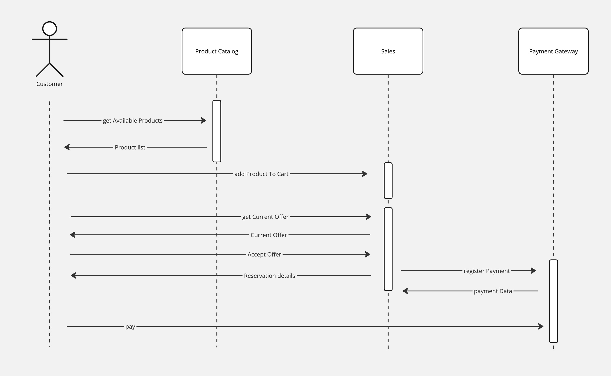

# Checkout
Design high level checkout process

### ToDoes
- Write E2E tests to verify the functionality of your frontend and backend integration.
- Simulate collecting products
- Simulate calculating offer
- Simulate offer acceptance products

### Checkout sequence diagram

### Unit test
Design & scaffold public interface for the sales module 

### E2E test
Check if application works as expected by simulating real-world user scenarios

#### Scenario
* Given:
  * There is customer
  * There is product identified by X 
  * Product identified by X costs 10.10
  * Customer adds product to cart 
  * Customer previews current offer
* When 
  * Customer accepts offer
* Then
  * Reservation for product is done
  * Payment URL is generated

#### Manual Browser Test
* Open http://localhost:8080
* click add to for product X
* check current offer
* click "accept offer" button
* confirm if redirected to payment

#### Bash curl test
* ``curl -X GET http://localhost:8080/api/products``
* ``curl -X POST http://localhost:8080/api/add-to-cart/{productId}``
* ``curl -X GET http://localhost:8080/api/current-offer``
* ``curl -X POST http://localhost:8080/api/accept-offer -d '{"fname":"John", "lname": "Doe", "email":"john.doe@example.com"}''``
* confirm if response contains paymentURL

## Essential Shortcuts
* assign selection to variable ``Ctrl + Alt + v``

## Files
* [src/test/java/pl/jkanclerz/ecommerce/sales/SalesTest.java](../src/test/java/pl/jkanclerz/ecommerce/sales/SalesTest.java)
* [src/main/java/pl/jkanclerz/ecommerce/sales/SalesFacade.java](../src/main/java/pl/jkanclerz/ecommerce/sales/SalesFacade.java)

* [src/test/java/pl/jkanclerz/ecommerce/sales/SalesHttpTest.java](../src/test/java/pl/jkanclerz/ecommerce/sales/SalesHttpTest.java)
* [src/main/java/pl/jkanclerz/ecommerce/sales/SalesController.java](../src/main/java/pl/jkanclerz/ecommerce/sales/SalesController.java)

* [src/main/java/pl/jkanclerz/ecommerce/App.java](../src/main/java/pl/jkanclerz/ecommerce/App.java)
* [src/main/java/pl/jkanclerz/ecommerce/sales/AcceptOfferRequest.java](../src/main/java/pl/jkanclerz/ecommerce/sales/AcceptOfferRequest.java)
* [src/main/java/pl/jkanclerz/ecommerce/sales/Offer.java](../src/main/java/pl/jkanclerz/ecommerce/sales/Offer.java)
* [src/main/java/pl/jkanclerz/ecommerce/sales/ReservationDetails.java](../src/main/java/pl/jkanclerz/ecommerce/sales/ReservationDetails.java)

