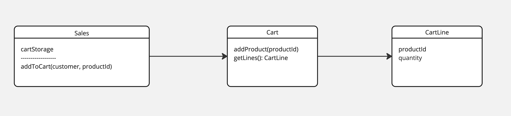

# Shopping cart
Let's consider following rules
* It allows to collect products
* It increase product quantity when already in the cart
* System allows to add product to cart
* System distinguish carts by customers

### ToDoes
- Design and create sales' submodule for cart management
- handle collecting products for cart module

### Cart class diagram

### Unit test
Design & verify cart behaviours 

## Files
* [src/test/java/pl/jkanclerz/ecommerce/sales/cart/CartTest.java](../src/test/java/pl/jkanclerz/ecommerce/sales/cart/CartTest.java)
* [src/main/java/pl/jkanclerz/ecommerce/sales/cart/Cart.java](../src/main/java/pl/jkanclerz/ecommerce/sales/cart/Cart.java)
* [src/main/java/pl/jkanclerz/ecommerce/sales/cart/CartItem.java](../src/main/java/pl/jkanclerz/ecommerce/sales/cart/CartItem.java)
