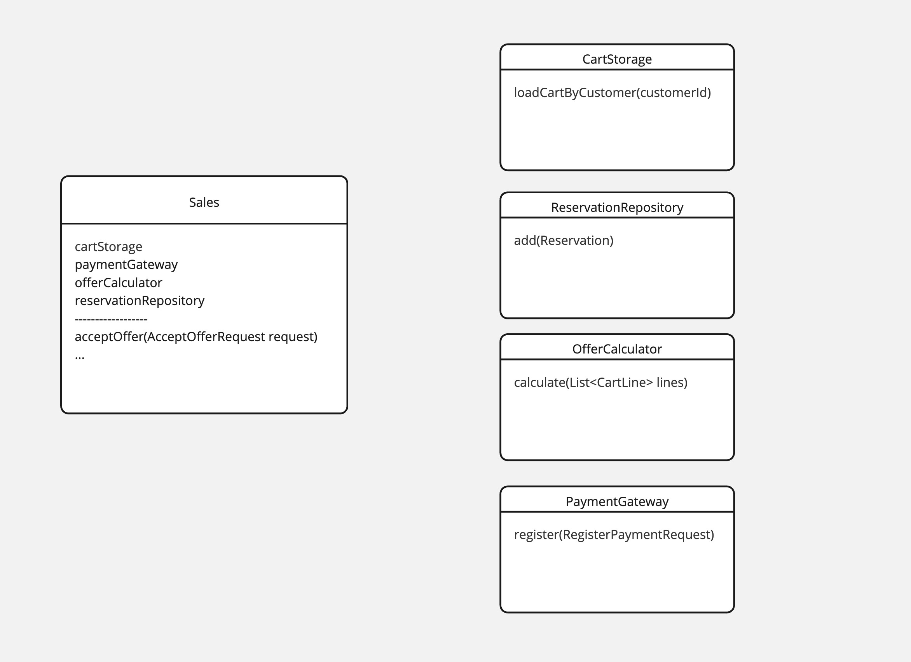
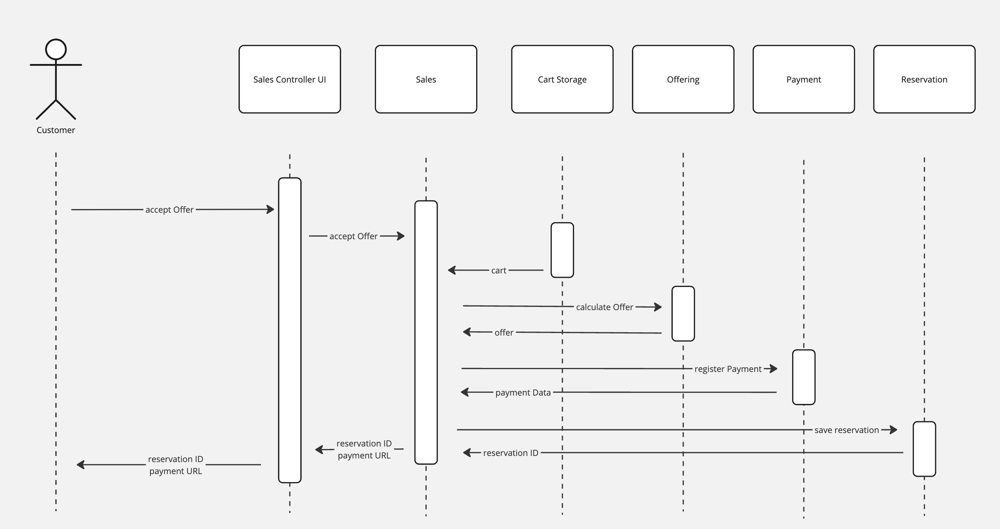

# Shopping cart

Transformation between Cart -> Offer -> Reservation

### ToDoes
- Gather reservation details 
- Describe scaffold for reservation & payment process
- Define integration point for Payment Gateway, even if payment GW is not specified yet

### Reservation major class diagram

### Reservation sequence diagram

### Unit test
* Design & verify reservation behaviour
* Define input & output for offer acceptance
* Deal with unknown, PaymentGateway with Spy implementation

## Files
* [src/test/java/pl/jkanclerz/ecommerce/sales/reservation/OfferAcceptanceTest.java](../src/test/java/pl/jkanclerz/ecommerce/sales/reservation/OfferAcceptanceTest.java)
* [src/test/java/pl/jkanclerz/ecommerce/sales/reservation/SpyPaymentGateway.java](../src/test/java/pl/jkanclerz/ecommerce/sales/reservation/SpyPaymentGateway.java)

